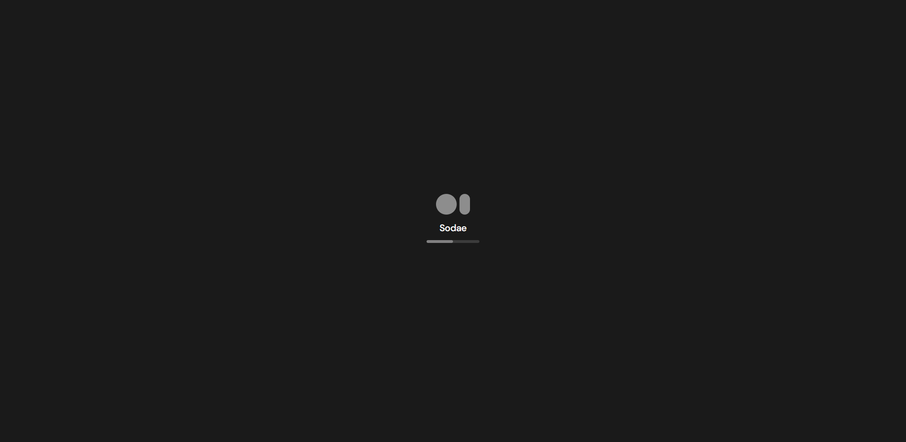
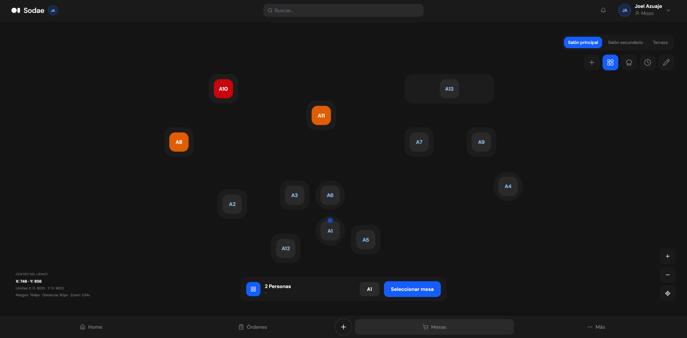
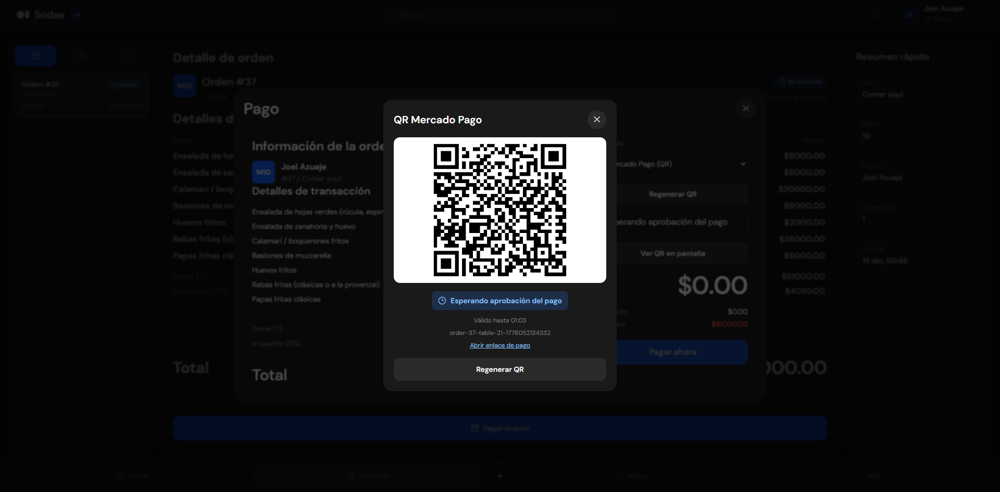

# Sodae - SaaS Multi-Tenant Gastronómico (Estructura Base)

Este repositorio contiene únicamente la **estructura de carpetas** de **Sodae**, un proyecto SaaS multi-tenant para el sector gastronómico.



## ¿Qué es Sodae?

**Sodae** es una plataforma SaaS pensada para digitalizar la operación completa de negocios gastronómicos.

Su propuesta central es unificar en un solo sistema:

- La operación de salón y caja (POS)
- La gestión de cocina y comandas
- La administración del negocio (usuarios, métricas y contabilidad)
- El acceso público y onboarding desde el sitio principal

Sodae está diseñado para operar en múltiples comercios (multi-tenant), permitiendo que cada restaurante, bar o cafetería tenga su propio espacio aislado dentro de la plataforma.

## Demo Visual

### Gestión de Mesas

Puedes mostrar una imagen o video del flujo de mesas (principal, secundario y terraza):



[VIDEO-DEMO](https://youtu.be/rzIzwL4FfK8)

### Mercado Pago

Imagen del flujo de cobro con QR de Mercado Pago:

 

[VIDEO-DEMO](https://youtu.be/_tiaAWkyocM)

## Enfoque del Proyecto

Plataforma orientada a:

- Restaurantes
- Bares
- Cafeterías
- Otros comercios gastronómicos

El objetivo es centralizar la operación diaria en una arquitectura escalable y modular.

## Modelo de Producto

- **Site**: landing pública, onboarding y acceso.
- **Admin**: backoffice para métricas, usuarios y contabilidad.
- **POS**: operación en tiempo real del negocio (mesas, pedidos, cocina, cobros).

## Funcionalidades Clave (esperadas)

- Gestión de mesas por zonas:
  - Piso principal
  - Piso secundario
  - Terraza
- Gestión de órdenes y comandas.
- Flujo de cocina y estado de tickets.
- Flujo de cobro y medios de pago.
- Gestión de usuarios por rol.
- Arquitectura multi-tenant por restaurante/comercio.
- Comunicación en tiempo real con **WebSockets/SSE** para sincronizar cambios en cocina, salón y caja.

## Stack Tecnológico (objetivo)

- **Frontend**: React + Next.js (App Router)
- **Backend/API**: Next.js Route Handlers
- **Lenguajes**: TypeScript, JavaScript, SQL
- **Base de datos**: MySQL/MariaDB
- **Tiempo real**: WebSockets o Server-Sent Events (SSE)
- **Estilos/UI**: CSS/Tailwind (según implementación)

## Estructura de Carpetas

```text
saas-gastro-structure-only/
  src/
    app/
      (site)/
        home/
        login/
        registro/
        r/
      (admin)/
        admin/
          users/
          metrics/
          accounting/
      (pos)/
        waiter/
        kitchen/
        tables/
        cobrar/
        restaurante/
      api/
        (public)/
          features/
          leads/
        (admin)/
          users/
          metrics/
          accounting/
        (pos)/
          orders/
          tables/
          kitchen/
          payments/
        (shared)/
          auth/
    components/
      floor-plan/
    modules/
      site/
      admin/
      pos/
      shared/
    lib/
  docs/
```

## Nota

Este repositorio está diseñado como **base de arquitectura de Sodae**:

- No incluye código fuente funcional de negocio.
- No incluye lógica de implementación.
- Sirve como plantilla estructural para iniciar un SaaS gastronómico multi-tenant.
